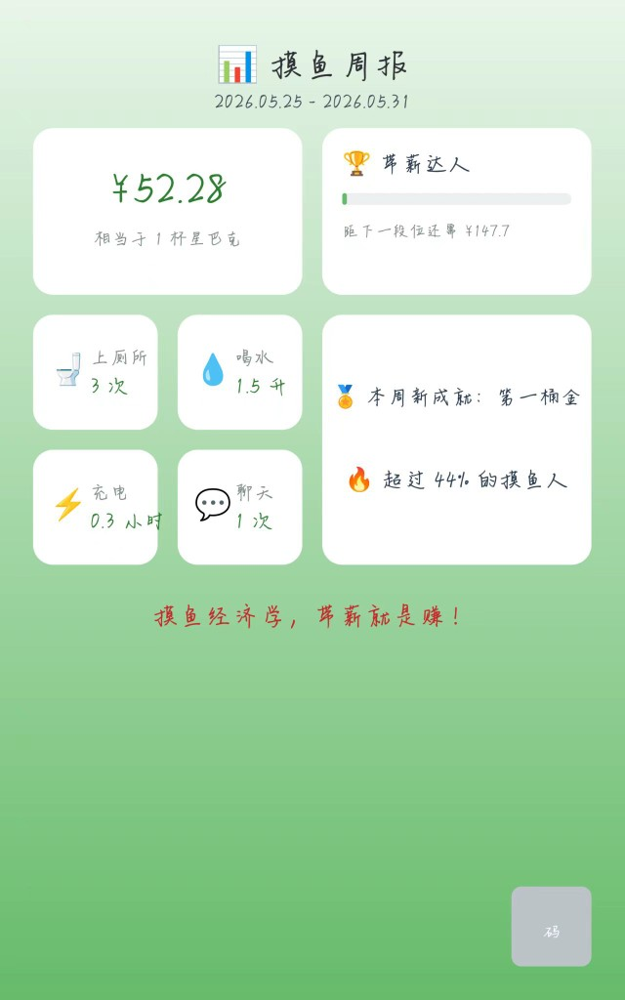

# 我把上班摸鱼做成了小程序，还养了一缸鱼

> 带薪拉屎、喝水、充电、聊天八卦——把碎片时间变成真金白银。  
> 该程序也是本人摸鱼做出来的，祝各位摸鱼愉快。

> **截图素材目录：** `wxchat/images/screenshots/`（发布到公众号 / 知乎时，在下方标记处插入对应图片）

---

## 一、起因：厕所里的经济学启蒙

你有没有算过，上一次带薪上厕所，到底「赚」了多少钱？

假设月薪 8000，每月工作 22 天、每天 8 小时，时薪大约 45 块，每分钟接近 0.76 元。蹲坑 15 分钟，理论上你就从老板那里「合理合法」地拿走了 11.4 元。

这不是教唆旷工，而是一种荒诞又真实的职场观察：**人一天里真正高效干活的时间，远没有考勤表上那么满。** 碎片时间——上厕所、接水、充电、茶水间八卦——早就存在，只是从来没人帮你记账。

于是就有了这个小程序：**摸鱼经济学**。

它的逻辑很简单：你在「我的」里填好月薪和工作时长，每次摸鱼点一下，系统自动按你的时薪换算成本月收入。月底一看，那个绿色的数字球，可能比你的绩效奖金更让人欣慰。

<!-- 📷 截图 1：主页 -->

*图 1 · 主页 — 本月摸鱼收入、四种摸鱼入口与生成海报*

---

## 二、四种摸鱼姿势，一种记账哲学

主页有四个大按钮，对应四种最常见的职场碎片行为：

| 摸鱼类型 | 怎么算钱 |
|---------|---------|
| 🚽 上厕所 | 按分钟计薪，带薪拉屎实锤 |
| 💧 喝水 | 按桶装水单价折算，喝得多赚得多 |
| ⚡ 充电 | 按电费单价 + 充电器功率，手机充满也是生产力 |
| 💬 聊天八卦 | 按分钟计薪，茶水间情报站不能白待 |

每一次记录都会进入「明细」，按月汇总。你还可以一键生成**摸鱼海报**或**摸鱼周报**——本周赚了 52.28 元，相当于一杯星巴克；超过 44% 的摸鱼人；新成就「第一桶金」已解锁。

把摸鱼这件事从「心虚」变成「可量化」，是这个小工具最微妙的地方。它不提供道德审判，只提供一本账。

<!-- 📷 截图 2：摸鱼周报 -->

*图 2 · 摸鱼周报 — 本周收益、段位进度与摸鱼数据一览*

---

## 三、从记账到养鱼：摸鱼币的二次流通

如果只记账，未免太像 Excel。所以我们又加了一个模块：**摸鱼养鱼场**。

逻辑是这样的——

1. 你本月摸鱼赚的人民币，可以**兑换成摸鱼币**（1 元 = 100 币）；
2. 用摸鱼币去商店买**神秘鱼卵**，开出小丑鱼、金鱼、斗鱼，乃至传说级物种；
3. 喂食、孵化、升级鱼缸设备，鱼长大了还能**卖出换币**；
4. 离线也会自动结算养鱼进度，回来收菜。

摸鱼收入不再是一个死数字，而变成了游戏里的流通货币。上班摸鱼养下班的鱼，赛博渔业闭环了。

<!-- 📷 截图 3：养鱼场 -->

*图 3 · 养鱼场 — 兑换摸鱼币、鱼塘空位与买鱼卵 / 孵化 / 喂食*

---

## 四、段位、宗师榜，和内卷的最后一公里

人嘛，有了数字就想比。

我们设计了一套从「摸鱼萌新」到「终极摸皇」的段位体系：

- 摸鱼萌新 → 划水学徒 → 带薪达人 → 摸鱼宗师 → 白嫖圣手 → 老板亏哭 → 摸鱼天尊 → 终极摸皇

还有成就徽章等着解锁：厕所哲学家、水牛转世、充电狂魔、茶水间之王、摸鱼全勤……名字起得浮夸，解锁条件却意外地需要长期坚持。

<!-- 📷 截图 4：我的 -->

*图 4 · 我的 — 时薪设置、段位进度与收益参数*

每周一凌晨，**宗师榜**定榜，累计摸鱼总额前 50 名获得「摸鱼宗师」称号。历史总榜常驻，方便你和朋友隔空较劲。

<!-- 📷 截图 5：宗师榜 -->

*图 5 · 宗师榜 — 本周预览榜与历史总榜*

当然，我们也做了反作弊：30 秒内重复提交、一小时刷 12 次、单次时长离谱——系统会标记「可疑」，摸鱼币归零，累计三次还会冻结 24 小时。

**摸鱼可以，刷数据不行。** 这是底线。

---

## 五、技术栈：摸鱼做出来的摸鱼工具

说点正经的。这个小程序用微信原生开发，后端走云开发（云函数 + 云数据库 + 云存储），图表用 ECharts，海报和周报用 Canvas 绘制。

主要模块包括：

- 摸鱼记录审核与云端同步
- 人民币 ↔ 摸鱼币兑换
- 养鱼场全套逻辑（商店、孵化、喂食、离线进度）
- 排行榜与周报生成
- 微信登录、头像云存储、本地/云端数据合并

代码开源在 GitHub：[github.com/paidaxin-12138/wxchat](https://github.com/paidaxin-12138/wxchat)  
协议：CC BY-NC 4.0，欢迎学习交流，未经允许请勿商用。

---

## 六、写在最后

摸鱼经济学不是什么严肃的生产力工具。

它更像一面镜子：照见打工人的碎片时间，照见那些「明明在上班、其实没那么上班」的日常瞬间。用荒诞的方式记录荒诞，用游戏化的方式消解一点点班味。

如果你也在厕所里刷到过这篇文章——

欢迎顺手记一笔。  
毕竟，**带薪就是赚。**

---

**摸鱼经济学** · 微信小程序  
GitHub：[paidaxin-12138/wxchat](https://github.com/paidaxin-12138/wxchat)
